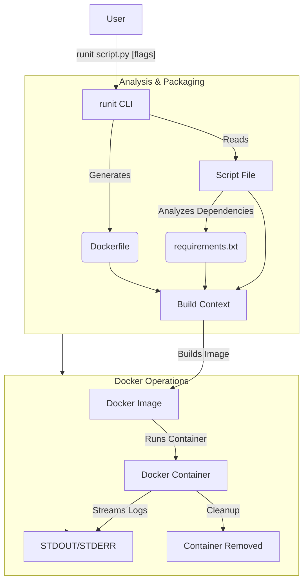

# 🚀 runit

Run Python scripts instantly in containers - no setup, no fuss, just run it.

[](https://goreportcard.com/report/github.com/kanthorlabs/runit)
[](LICENSE)
[](go.mod)
[](https://github.com/kanthorlabs/runit/releases)

---

## ✨ Features

- 🐍 **Zero Python Setup** - No local Python installation needed
- 🔒 **Isolated Environment** - Each script runs in its own container
- 📦 **Auto Dependencies** - Automatically detects and installs required packages
- 🎯 **Simple Interface** - Single command to run any Python script
- 🔌 **Port Forwarding** - Easy exposure of network services
- 🎨 **Version Flexible** - Use any Python version you need

## 🚀 Quick Start

### Installation

```bash
go install github.com/kanthorlabs/runit/cmd/runit@latest
```

### Basic Usage

```bash
# Run a simple script
runit script.py

# Run with specific Python version
runit --platform-version python:3.11-slim script.py

# Expose ports
runit --ports 8080 webapp.py

# Pass arguments to your script
runit github-analyzer.py --arguments="kanthorlabs/runit"
```

## 🎯 Command Reference

### Syntax

```bash
runit [flags] <script>
```

### Flags

| Flag                  | Description                                    | Default            |
|-----------------------|------------------------------------------------|--------------------|
| `--platform-version`  | Python Docker image version                    | `python:3.13-slim` |
| `--ports`             | Expose ports (repeatable)                      | -                  |
| `--arguments`         | Script arguments                               | -                  |
| `--params`            | Script parameters                              | -                  |

### 🎭 Advanced Examples

> **Note:** You can find the source code for these examples in the [examples/python](examples/python) directory.

```bash
# Web application with multiple ports
runit webapp.py --ports 8080 --ports 9090

# GitHub analyzer with authentication
runit examples/python/github-analyzer.py \
  --arguments="kanthorlabs/runit" \
  --params="--token=xxx"

# Machine learning script with specific Python version
runit examples/python/analyze-image.py \
  --platform-version python:3.11-slim \
  --arguments="https://i.ibb.co/KxcPH8LF/Screenshot-2025-03-11-at-11-09-33.png" \
  --params="--api-key=sk-proj-xxx"
```

## 🏗️ Architecture



## 🧩 How It Works

1. **Analysis**: Scans your Python script for dependencies
2. **Packaging**: Creates a container with your script and dependencies
3. **Execution**: Runs the script in an isolated environment
4. **Cleanup**: Automatically removes the container after execution

## 💡 Pro Tips

- Use `python:*-slim` images for faster downloads
- Leverage port forwarding for web applications
- Include requirements.txt for explicit dependencies
- Use environment variables for sensitive data

## 🤝 Contributing

We welcome contributions! Here's how you can help:

- 🐛 Report bugs
- 💡 Suggest features
- 🔧 Submit pull requests
- 📖 Improve documentation

## 📝 License

MIT License - [View License](LICENSE)

---

<div align="center">
Made with ❤️ by <a href="https://github.com/kanthorlabs">Kanthor Labs</a>
</div>

