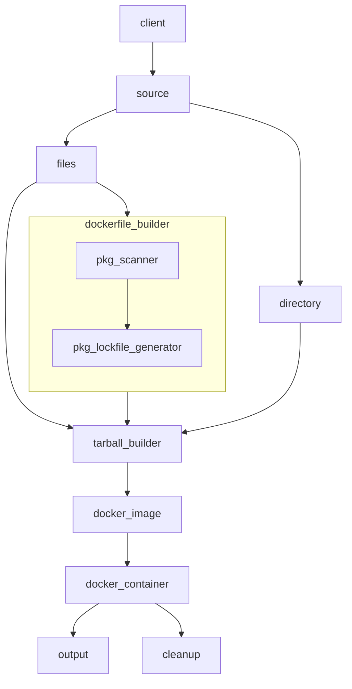

# System Design

```mermaid
flowchart TB;
  client --> source

  source --> files;
  files --> tarball_builder;
  files --> dockerfile_builder;

  subgraph dockerfile_builder
  direction TB
  pkg_scanner --> pkg_lockfile_generator;
  end

  dockerfile_builder --> tarball_builder;

  source --> directory;
  directory --> tarball_builder;

  tarball_builder --> docker_image;
  docker_image --> docker_container;
  docker_container --> output;
  docker_container --> cleanup;
```
